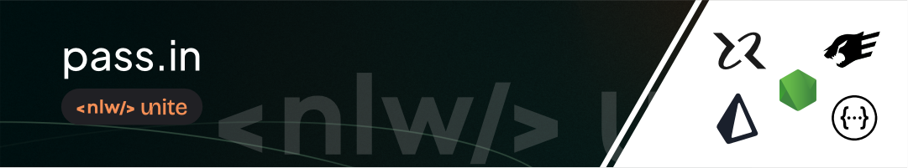
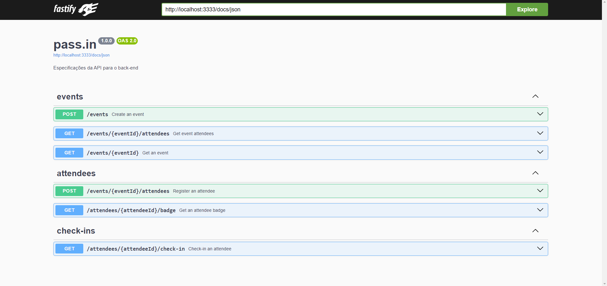

## 📝Pass.in API
### Project developed during Rocketseat's NLW Unite

## 🎯Goal
### Develop the rest API for an event ticketing application




### ▶️Run
```
npm run dev
```

## 👨🏻‍💻Tecnologies

  - Node.js

  - Typescript

  - Fastify:    Framework HTTP

  - Swagger:    API Documentation

  - Prisma:     ORM
  
  - Zod:        data validation

  - SQLite:     database

### 🪛Script settings
```
    "dev": "tsx watch --env-file .env src/server.ts",
    "test": "echo \"Error: no test specified\" && exit 1",
    "build": "tsup src --format esm",
    "start": "node dist/server.mjs",
    "db:migrate": "prisma migrate dev",
    "db:studio": "prisma studio"
```

#


<p align="center">
  
  <p align="center" style="font-size: 12px">Jackson Freitas<p>
</p>